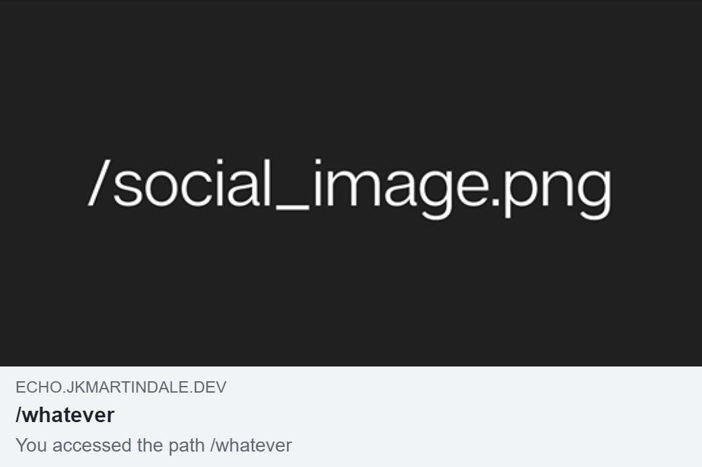
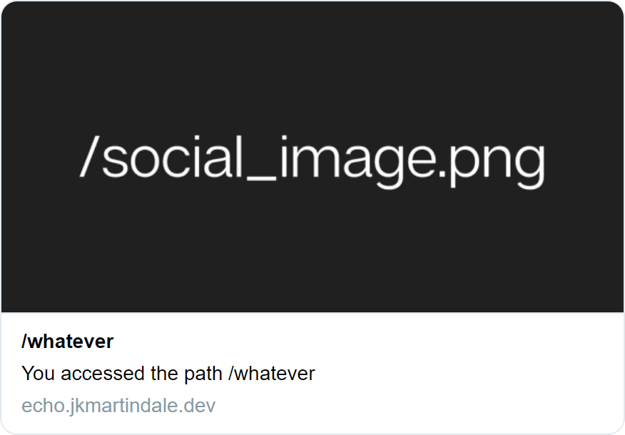

## echo

Web service that spits out the path you visit it from. Probably a bad idea.

For example, visiting <https://echo.jkmartindale.dev/whatever> results in a page displaying **/whatever** in the viewport, page title, Open Graph metadata, and Twitter Card:  
  
  
  

I suck at web design so of course this breaks on long paths. Please fix it for me.
